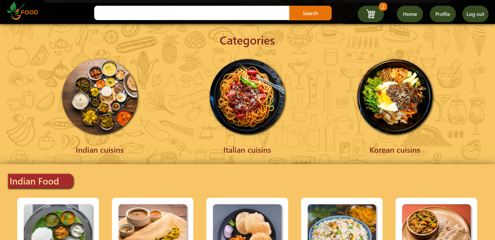
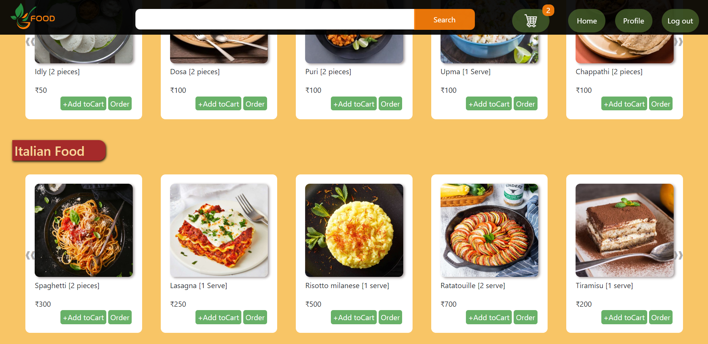
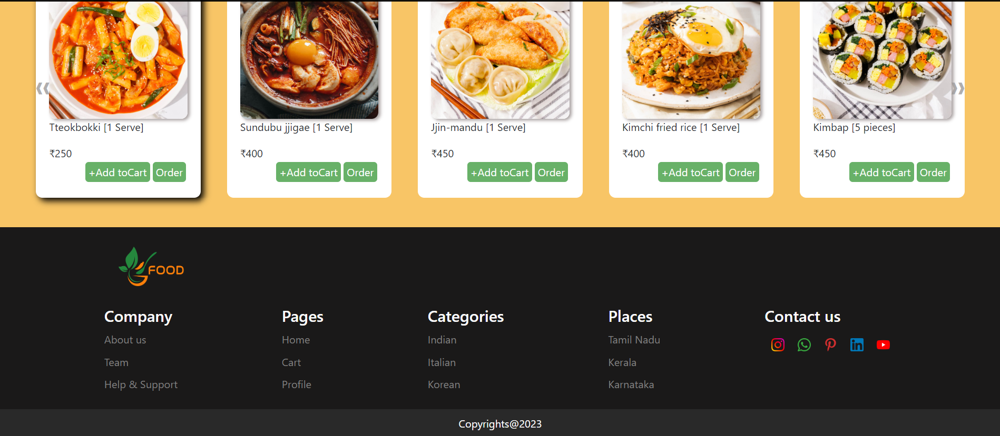
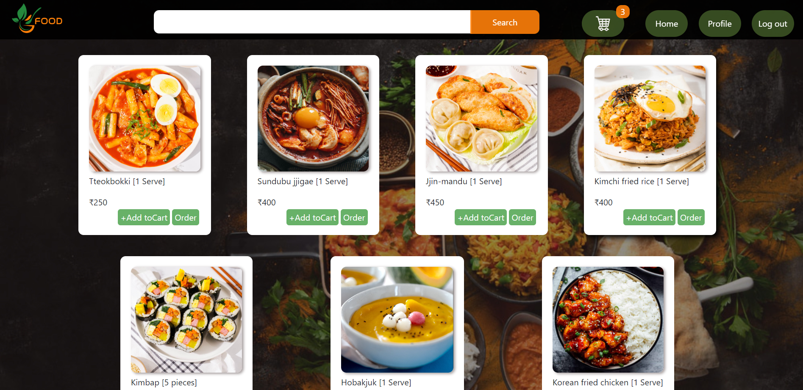
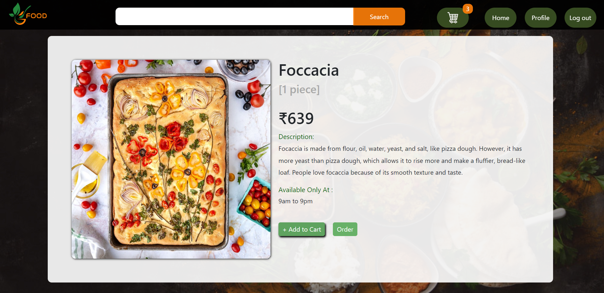
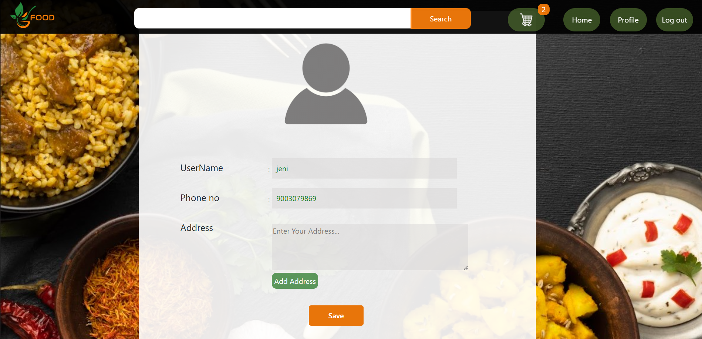
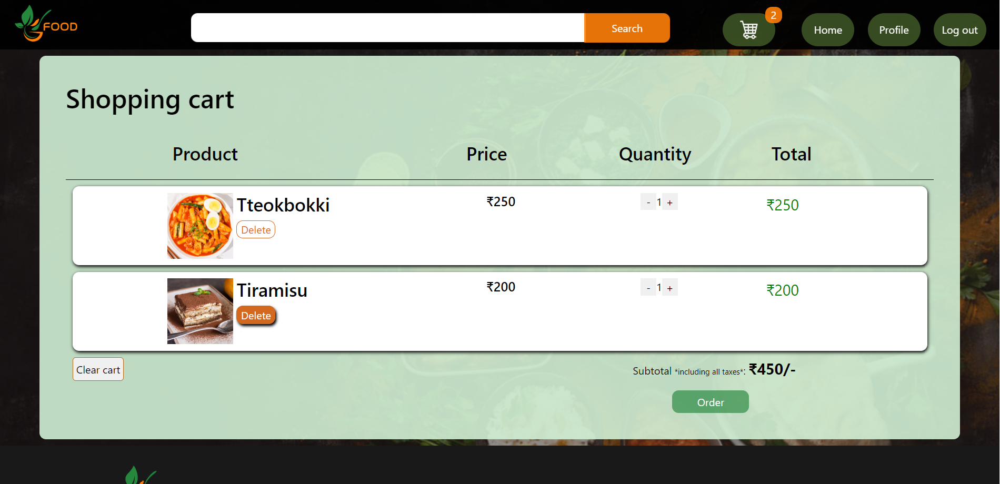

# Food Ordering Website

Welcome to the Food Ordering Website project! This is a mini project created with React.js, Redux,Html and CSS for ordering food online. The website includes features such as user authentication, a home page with a menu, category pages, detailed food pages, a user profile, and a shopping cart.

## Screenshots

### Login Page

### Register Page

### Home Page

### Category Page

### Single Food Page

### Profile Page

### Cart Page

## Features

- **User Authentication**: Users can register and log in with validation. User data is stored in local storage for simplicity in this mini project.

- **Home Page**: The home page includes a top menu, an image slider for ads, and categories of food.

- **Category Page**: Each category has its own page with a list of foods related to that category.

- **Single Food Page**: Clicking on a food item in a category navigates the user to a detailed page about that specific food.

- **Profile Page**: Users have a profile page where they can view and edit their personal information.

- **Cart Page (Redux)**: The cart page is implemented with Redux, allowing users to perform the following actions:
  - Add items to the cart
  - Delete items from the cart
  - Clear the entire cart
  - Adjust item quantities with a responsive total

## Technologies Used

- React.js
- Redux
- Html
- CSS

